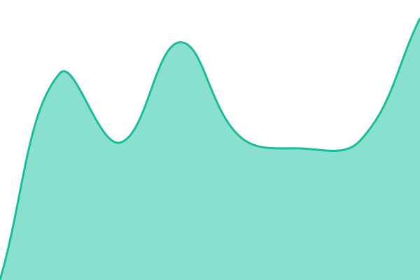
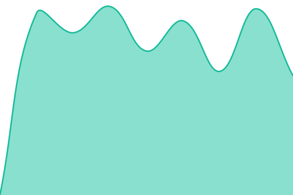
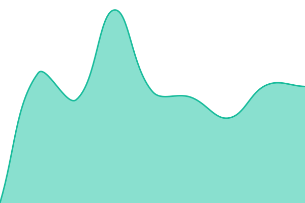

# [📈 Live Status](https://status.lachmanovi.eu): <!--live status--> **🟩 All systems operational**

This repository contains the open-source uptime monitor and status page for [František Lachman](https://mastodonczech.cz/@lachmanfrantisek), powered by [Upptime](https://github.com/upptime/upptime).

With [Upptime](https://upptime.js.org), you can get your own unlimited and free uptime monitor and status page, powered entirely by a GitHub repository. We use [Issues](https://github.com/lachmanfrantisek/upptime/issues) as incident reports, [Actions](https://github.com/lachmanfrantisek/upptime/actions) as uptime monitors, and [Pages](https://status.lachmanovi.eu) for the status page.

<!--start: status pages-->
<!-- This summary is generated by Upptime (https://github.com/upptime/upptime) -->
<!-- Do not edit this manually, your changes will be overwritten -->
<!-- prettier-ignore -->
| URL | Status | History | Response Time | Uptime |
| --- | ------ | ------- | ------------- | ------ |
|  [Scoutcloud (Nextcloud)](https://scoutcloud.eu/status.php) | 🟩 Up | [scoutcloud-nextcloud.yml](https://github.com/lachmanfrantisek/upptime/commits/HEAD/history/scoutcloud-nextcloud.yml) | 

 748ms
     
 | 

<a href="https://status.lachmanovi.eu/history/scoutcloud-nextcloud">100.00%</a>
    

|  [Lachmanovi (Nextcloud)](https://lachmanovi.eu/status.php) | 🟩 Up | [lachmanovi-nextcloud.yml](https://github.com/lachmanfrantisek/upptime/commits/HEAD/history/lachmanovi-nextcloud.yml) | 

 674ms
     
 | 

<a href="https://status.lachmanovi.eu/history/lachmanovi-nextcloud">100.00%</a>
    

|  [Home Assistant](https://home.r.lachmanovi.eu) | 🟩 Up | [home-assistant.yml](https://github.com/lachmanfrantisek/upptime/commits/HEAD/history/home-assistant.yml) | 

 627ms
     
 | 

<a href="https://status.lachmanovi.eu/history/home-assistant">100.00%</a>
    

|  [Metalignum (WordPress)](https://metalignum.cz) | 🟩 Up | [metalignum-word-press.yml](https://github.com/lachmanfrantisek/upptime/commits/HEAD/history/metalignum-word-press.yml) | 

 1921ms
     
 | 

<a href="https://status.lachmanovi.eu/history/metalignum-word-press">100.00%</a>
    

|  [Collabora Office](https://office.scoutcloud.eu) | 🟩 Up | [collabora-office.yml](https://github.com/lachmanfrantisek/upptime/commits/HEAD/history/collabora-office.yml) | 

 767ms
     
 | 

<a href="https://status.lachmanovi.eu/history/collabora-office">100.00%</a>
    

|  [Cockpit](https://cockpit.lachmanovi.eu) | 🟩 Up | [cockpit.yml](https://github.com/lachmanfrantisek/upptime/commits/HEAD/history/cockpit.yml) | 

 1042ms
     
 | 

<a href="https://status.lachmanovi.eu/history/cockpit">100.00%</a>
    

|  [Beszel Monitor](https://monitor.lachmanovi.eu) | 🟩 Up | [beszel-monitor.yml](https://github.com/lachmanfrantisek/upptime/commits/HEAD/history/beszel-monitor.yml) | 

 614ms
     
 | 

<a href="https://status.lachmanovi.eu/history/beszel-monitor">100.00%</a>
    

|  [ScoutCloud DAV](https://scoutcloud.eu/remote.php/dav/) | 🟩 Up | [scout-cloud-dav.yml](https://github.com/lachmanfrantisek/upptime/commits/HEAD/history/scout-cloud-dav.yml) | 

 712ms
     
 | 

<a href="https://status.lachmanovi.eu/history/scout-cloud-dav">100.00%</a>
    

|  [Family DAV](https://lachmanovi.eu/remote.php/dav/) | 🟩 Up | [family-dav.yml](https://github.com/lachmanfrantisek/upptime/commits/HEAD/history/family-dav.yml) | 

 676ms
     
 | 

<a href="https://status.lachmanovi.eu/history/family-dav">100.00%</a>
    

|  [ScoutCloud Login](https://scoutcloud.eu/login) | 🟩 Up | [scout-cloud-login.yml](https://github.com/lachmanfrantisek/upptime/commits/HEAD/history/scout-cloud-login.yml) | 

 806ms
     
 | 

<a href="https://status.lachmanovi.eu/history/scout-cloud-login">100.00%</a>
    

|  [Family Login](https://lachmanovi.eu/login) | 🟩 Up | [family-login.yml](https://github.com/lachmanfrantisek/upptime/commits/HEAD/history/family-login.yml) | 

 848ms
     
 | 

<a href="https://status.lachmanovi.eu/history/family-login">100.00%</a>
    

|  [ntfy Notifications](https://ntfy.lachmanovi.eu/v1/health) | 🟩 Up | [ntfy-notifications.yml](https://github.com/lachmanfrantisek/upptime/commits/HEAD/history/ntfy-notifications.yml) | 

 581ms
     
 | 

<a href="https://status.lachmanovi.eu/history/ntfy-notifications">100.00%</a>
    

<!--end: status pages-->

[**Visit our status website →**](https://status.lachmanovi.eu)

## 📄 License

- Powered by: [Upptime](https://github.com/upptime/upptime)
- Code: [MIT](./LICENSE) © [Anand Chowdhary](https://anandchowdhary.com)
- Data in the `./history` directory: [Open Database License](https://opendatacommons.org/licenses/odbl/1-0/)

# test
